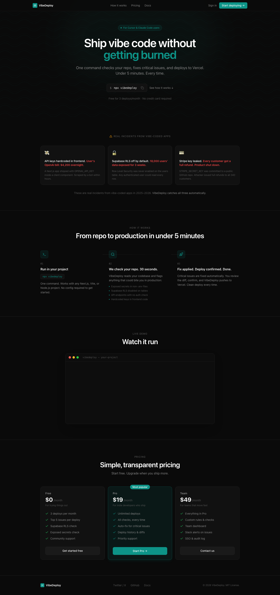
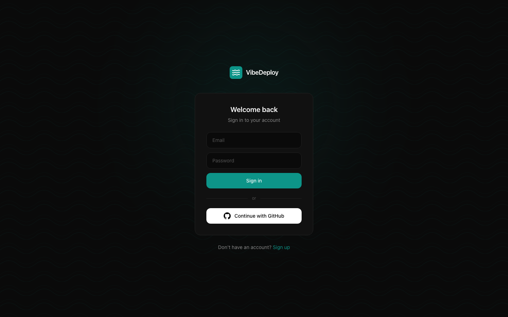
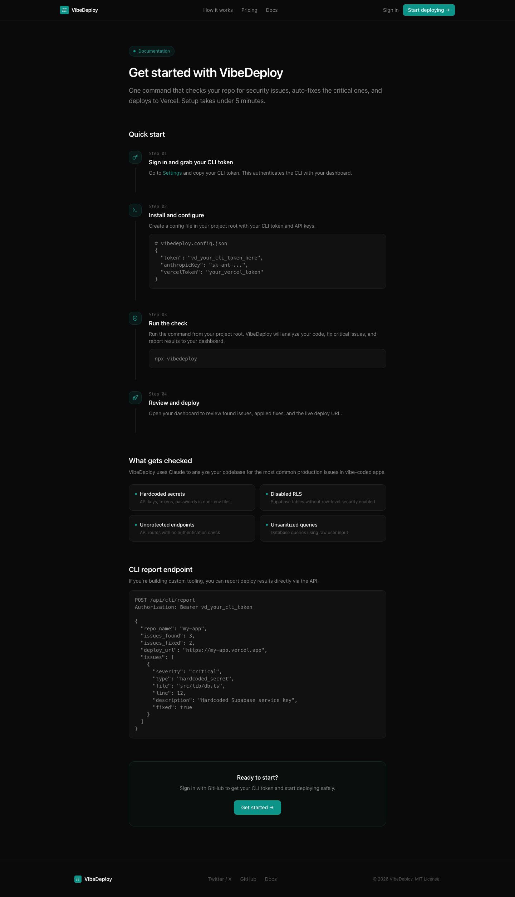

<div align="center">

# 🛡️ VibeDeploy

**AI-powered security auditor for web apps.**
Connect your GitHub repo, get an instant security grade (A–F) with concrete fix recommendations.

[](LICENSE)
[](https://nextjs.org)
[](https://anthropic.com)
[](https://supabase.com)
[](https://vercel.com)
[](CONTRIBUTING.md)

[**Live demo**](https://web-seven-delta-81.vercel.app) · [**Quick start**](#-quick-start) · [**Contributing**](CONTRIBUTING.md) · [**Report a bug**](../../issues/new?template=bug_report.yml)

</div>

---

## ✨ Why VibeDeploy

Most security scanners are noisy. They flag every theoretical risk and bury real issues in a wall of warnings. VibeDeploy asks Claude to act like a senior auditor — only report exploitable issues, cite the exact line, suggest a concrete fix.

- **Real findings, not noise.** Strict prompt engineering forces 0–3 grounded findings on healthy code.
- **Grade you can ship behind.** A through F with a 2–3 sentence summary you can paste into a PR.
- **Pasted code or full repo.** Drop a snippet for a quick check, or connect GitHub for a full audit.
- **Fast.** Audits complete in 15–30 seconds.
- **Private by default.** OAuth grants per-user repo access. Code is read for the audit run, not retained.

---

## 📸 Screenshots



| Sign in | Docs |
| --- | --- |
|  |  |

---

## 🧠 How it works

```
  ┌──────────────┐    OAuth     ┌─────────────┐    fetch tree    ┌─────────────┐
  │  You + repo  │ ───────────▶ │  VibeDeploy │ ───────────────▶ │  GitHub API │
  └──────────────┘              └──────┬──────┘                  └─────────────┘
                                       │
                              up to 30 code files
                                       │
                                       ▼
                                ┌──────────────┐    JSON report   ┌─────────────┐
                                │ Claude Opus  │ ───────────────▶ │  Supabase   │
                                └──────────────┘                  └─────────────┘
                                       │
                                       ▼
                                Grade · Score · Findings
```

1. **Sign in** with GitHub (OAuth, `repo` scope).
2. **Pick a repository** — public or private.
3. **Audit runs** server-side. Code is fetched, batched, sent to Claude with a strict auditor prompt.
4. **Findings stream back** — severity, file, line, description, fix.

---

## 🚀 Quick start

### Prerequisites

- Node.js 18+
- A [Supabase](https://supabase.com) project (free tier works)
- A [GitHub OAuth App](https://github.com/settings/developers)
- An [Anthropic API key](https://console.anthropic.com)

### Install

```bash
git clone https://github.com/rife888-art/vibedeploy-oss.git
cd vibedeploy-oss
npm install
```

### Configure

```bash
cp apps/web/.env.example apps/web/.env.local
# Open apps/web/.env.local and fill in your keys
```

Run the schema in the Supabase SQL editor:

```bash
# supabase/schema.sql
```

### Run

```bash
cd apps/web
npm run dev
```

Open [http://localhost:3000](http://localhost:3000).

---

## 🧱 Tech stack

| Layer       | Choice                                                    |
| ----------- | --------------------------------------------------------- |
| Framework   | Next.js 14 (App Router, Server Components)                |
| Auth        | NextAuth.js + GitHub OAuth + email/password fallback      |
| Database    | Supabase (PostgreSQL)                                     |
| AI          | Anthropic Claude (Opus 4)                                 |
| Background  | `@vercel/functions` `waitUntil`                           |
| Hosting     | Vercel                                                    |
| Styling     | Tailwind CSS, dark theme, teal accent                     |
| CLI         | Node.js (publish target: `vibedeploy` on npm)             |

---

## 📂 Project structure

```
vibedeploy/
├── apps/
│   └── web/                    # Next.js app
│       ├── app/
│       │   ├── api/
│       │   │   ├── audits/     # Start audits, list, paste mode
│       │   │   ├── github/     # List user's repos
│       │   │   ├── auth/       # NextAuth + signup
│       │   │   ├── cli/        # CLI report ingestion
│       │   │   └── settings/   # Encrypted user settings
│       │   ├── dashboard/      # Audit list, detail, settings
│       │   └── auth/signin/    # Custom sign-in
│       ├── components/         # UI primitives
│       └── lib/                # auth, supabase, rate-limit
├── packages/
│   └── cli/                    # CLI scanner
└── supabase/
    └── schema.sql              # DB schema
```

---

## 🔐 Security model

- All API routes require an authenticated session.
- The Supabase service role key is **server-side only**. Never exposed to the client.
- GitHub access tokens live in the JWT, not the database.
- Sensitive settings (API keys) are encrypted at rest with AES-256-CBC.
- CSRF defense via Origin/host check on auth routes.
- Constant-time CLI token comparison (`timingSafeEqual` on padded buffers).
- Per-IP and per-user rate limits on every mutating endpoint.
- HMAC of the token used as the rate-limit key. The token never appears in logs.

Found a vulnerability? See [SECURITY.md](SECURITY.md).

---

## 📡 API

| Method     | Endpoint              | Description                              |
| ---------- | --------------------- | ---------------------------------------- |
| `GET`      | `/api/github/repos`   | List the signed-in user's GitHub repos   |
| `POST`     | `/api/audits`         | Start a new repo audit                   |
| `GET`      | `/api/audits`         | List the user's audits                   |
| `GET`      | `/api/audits/[id]`    | Audit details + findings                 |
| `POST`     | `/api/audits/paste`   | Audit pasted code (no GitHub needed)     |
| `POST`     | `/api/cli/report`     | Receive CLI deploy reports               |
| `GET/POST` | `/api/settings`       | Get or store user settings (encrypted)   |

---

## 🤝 Contributing

Pull requests welcome. The diff surface is small and friendly to first-time contributors.

- 🐛 [Report a bug](../../issues/new?template=bug_report.yml)
- ✨ [Request a feature](../../issues/new?template=feature_request.yml)
- 📝 Read [CONTRIBUTING.md](CONTRIBUTING.md) before opening a PR
- 💛 Read [CODE_OF_CONDUCT.md](CODE_OF_CONDUCT.md)

Good first issues are tagged [`good first issue`](../../issues?q=is%3Aopen+label%3A%22good+first+issue%22).

---

## 🗺️ Roadmap

- [ ] GitLab + Bitbucket support
- [ ] PR comment bot (post audit summary as a check)
- [ ] Per-finding "ignore" list with rationale
- [ ] SARIF export for GitHub Code Scanning
- [ ] Self-hosted mode docs (Docker Compose)
- [ ] Multi-language audit prompts (Python, Go, Rust)

Have an idea? [Open an issue](../../issues/new?template=feature_request.yml).

---

## 📜 License

[MIT](LICENSE) — do anything, just keep the notice.

---

<div align="center">

If VibeDeploy caught a real bug for you, **star the repo** ⭐
It helps more builders find it.

</div>
